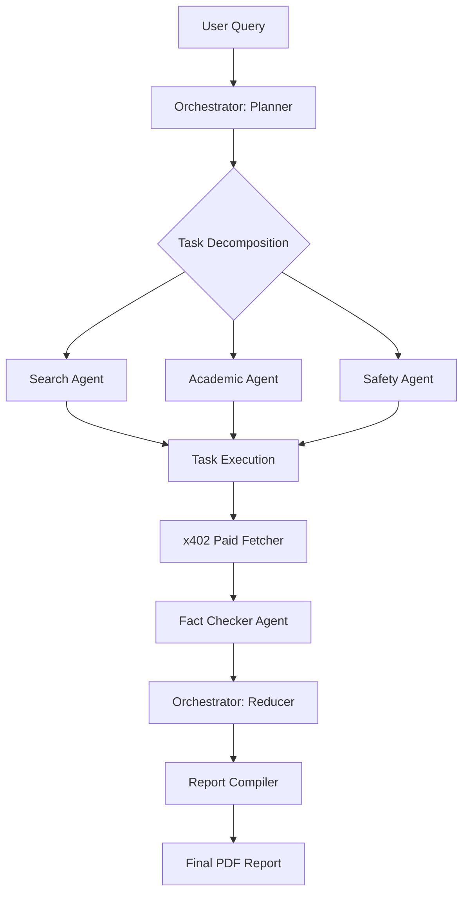
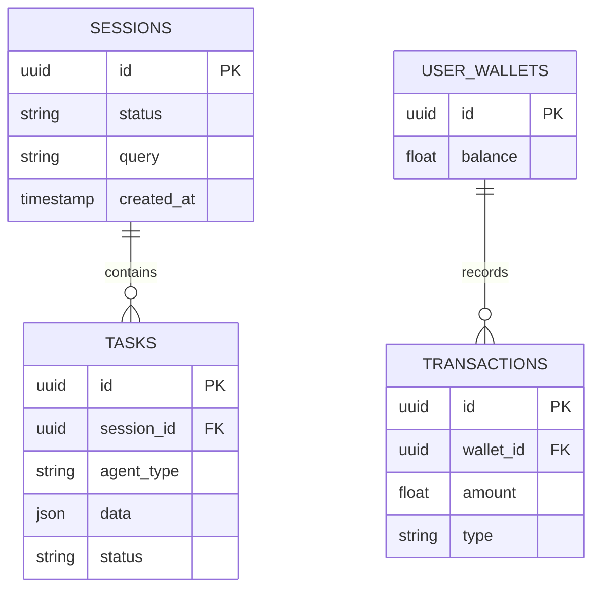

# axiom

Autonomous Multi-Agent Research Orchestrator for high-fidelity data synthesis and verified reporting.


Axiom is a professional-grade research platform that leverages specialized AI agents to perform autonomous deep-web and academic searches. By utilizing an advanced orchestration layer (Plan-Execute-Reduce), the system breaks down complex queries into manageable sub-tasks, fetches high-quality data through paid resource protocols, and synthesizes the findings into comprehensive, fact-checked PDF reports.

---

## System Architecture

### Orchestrator Logic Flow
The following diagram illustrates how a single research query is decomposed and processed through the multi-agent pipeline.



### Data Relationship Model
Axiom uses Supabase for managing persistent states, session histories, and the internal credit economy.



---

## Problem Statement

Traditional LLM interactions are often limited by stale training data, hallucinations, and a lack of depth in specialized fields. Researchers require a system that can:
1.  Navigate the live web and academic databases simultaneously.
2.  Decompose complex requests into verifiable sub-steps.
3.  Handle the economic layer of data acquisition where high-quality info resides behind paywalls.
4.  Consolidate hundreds of data points into a single, cohesive, and cited document.

---

## Solution Overview

Axiom solves these challenges through a **Modular Agentic Framework**. It treats research as a computational graph rather than a linear chat. By implementing a "Budgeted Research" model, users can allocate credits to agents, which then use these credits to purchase access to premium data points via the `x402` resource protocol. The result is a high-density intelligence report that is far more reliable than a standard LLM response.

---

## Key Features

*   **Autonomous Orchestration**: Uses a Planner/Executor/Reducer pattern to ensure comprehensive topic coverage.
*   **Specialized Agents**: Dedicated agents for Academic Search (scholarly papers), General Web Search (Tavily integration), and Safety/Fact-Checking.
*   **x402 Resource Protocol**: A custom implementation for programmatically fetching and paying for data resources in real-time.
*   **Credit-Based Economy**: Integrated wallet system with Stripe for managing research budgets and resource costs.
*   **Live Session Tracking**: Real-time visualization of agent progress and task status via a dashboard.
*   **Automated PDF Synthesis**: Compiles research findings into structured, professional documents ready for distribution.

---

## Tech Stack

| Category | Technology | Purpose |
| :--- | :--- | :--- |
| Framework | Next.js 15 (App Router) | Full-stack application structure and SSR |
| Language | TypeScript | Type-safe development and complex state management |
| Database | Supabase (Postgres) | Real-time data synchronization and persistent storage |
| AI Models | Google Gemini 2.0 | Core reasoning, planning, and synthesis engine |
| Search API | Tavily | Specialized search engine optimized for AI agents |
| Payments | Stripe | Credit top-ups and financial transaction handling |
| UI Components | Radix UI / Shadcn | Accessible and consistent interface components |
| PDF Generation | React-PDF | Server-side and client-side report compilation |

---

## Quick Start / Installation

### Prerequisites
*   Node.js 20+
*   Supabase CLI (for local migrations)
*   Stripe CLI (for webhook testing)

### Setup Commands
```bash
# Clone the repository
git clone https://github.com/TanmayAggarwal87/axiom.git
cd axiom

# Install dependencies
npm install

# Initialize Supabase
supabase start

# Run database migrations
npm run db:migrate

# Start the development server
npm run dev
```

---

## Environment Variables

| Variable | Description | Example | Required |
| :--- | :--- | :--- | :--- |
| `NEXT_PUBLIC_SUPABASE_URL` | Supabase Project URL | `https://xyz.supabase.co` | Yes |
| `NEXT_PUBLIC_SUPABASE_ANON_KEY` | Supabase Client Key | `eyJhbGc...` | Yes |
| `GEMINI_API_KEY` | Google AI Studio Key | `AIzaSy...` | Yes |
| `TAVILY_API_KEY` | Tavily Search API Key | `tvly-...` | Yes |
| `STRIPE_SECRET_KEY` | Stripe API Secret | `sk_test_...` | Yes |
| `STRIPE_WEBHOOK_SECRET` | Stripe Webhook Secret | `whsec_...` | Yes |

```env
# Example .env.local
NEXT_PUBLIC_SUPABASE_URL=your_url
NEXT_PUBLIC_SUPABASE_ANON_KEY=your_key
GEMINI_API_KEY=your_gemini_key
TAVILY_API_KEY=your_tavily_key
```

---

## API Endpoints

| Method | Endpoint | Description | Auth |
| :--- | :--- | :--- | :--- |
| POST | `/api/research/start` | Initiates a new research session | User Session |
| GET | `/api/research/session/[id]` | Fetches the status and results of a session | User Session |
| POST | `/api/wallet/topup` | Initiates a Stripe checkout session for credits | User Session |
| GET | `/api/wallet/balance` | Retrieves current user credit balance | User Session |

### Example Request
```bash
curl -X POST https://axiom.app/api/research/start \
  -H "Content-Type: application/json" \
  -d '{"query": "The impact of quantum computing on modern cryptography", "budget": 10}'
```

---

## Project Structure

```text
axiom/
├── src/
│   ├── agents/            # specialized AI agents (Search, Academic, Safety)
│   ├── app/               # Next.js App Router (Pages and API Routes)
│   ├── components/        # UI library (Research views, Wallet, Payments)
│   ├── lib/
│   │   ├── orchestrator/  # Planner, Executor, and Reducer logic
│   │   ├── x402/          # Paid resource fetching protocol
│   │   ├── supabase/      # Database client and helper functions
│   │   └── credits/       # Credit management logic
│   └── types/             # Shared TypeScript interfaces
├── supabase/
│   └── migrations/        # SQL schema definitions
├── scripts/               # Utility scripts for treasury and testing
└── public/                # Static assets
```

---

## Deployment & Architecture Decisions

### Choice: Orchestrator Pattern
Instead of a simple "prompt and response" model, we chose a three-stage Orchestrator pattern. This decision was made to ensure that complex queries are thoroughly investigated. The **Planner** ensures nothing is missed, the **Executor** handles parallel processing for speed, and the **Reducer** synthesizes conflicting data points.

### Choice: Supabase Real-time
For the "Live Session View," we opted for Supabase's real-time subscriptions over standard polling. This reduces server load and provides a seamless UX where users see agent thoughts and task completions as they happen.

### Choice: Gemini 2.0
We utilize Gemini 2.0 due to its massive context window, which is critical during the **Reducer** phase when the system must ingest dozens of search results and academic papers simultaneously to generate a final report.

---

## Technical Challenges & Solutions

### Challenge 1: Context Window Management
**Problem**: When agents perform extensive research, the resulting data often exceeds the context limit of the LLM during synthesis.
**Solution**: Implemented a recursive reduction strategy. Small clusters of research tasks are reduced into "summaries" first, and these summaries are then reduced into the final report sections, preserving key citations throughout.

### Challenge 2: Economic Safety (Infinite Loops)
**Problem**: Autonomous agents could theoretically trigger infinite search loops, draining user credits.
**Solution**: We introduced a `BudgetManager` class within the orchestrator. Every task must request a credit allocation before execution. If the session budget is exceeded, the orchestrator terminates the loop and forces a reduction of currently available data.

---

## Development Commands

| Command | Description |
| :--- | :--- |
| `npm run dev` | Starts the Next.js development server |
| `npm run build` | Compiles the production application |
| `npm run test` | Runs the full test suite (Jest) |
| `npm run lint` | Performs static analysis and code formatting checks |
| `npm run db:migrate` | Applies Supabase migrations to the database |

---

## Testing Approach

Axiom maintains a rigorous testing standard across three tiers:
1.  **Unit Tests**: Focused on individual agent logic and utility functions in `src/lib`.
2.  **Orchestrator Simulations**: Located in `src/lib/orchestrator/__tests__`, these simulate full research cycles with mocked API responses to ensure the state machine is robust.
3.  **End-to-End (E2E)**: Scripts in `scripts/e2e-test.ts` verify the integration between the API, Database, and LLM providers.

---

## License

This project is licensed under the MIT License.

---

## Author

Built by [Tanmay Aggarwal](https://github.com/TanmayAggarwal87)
