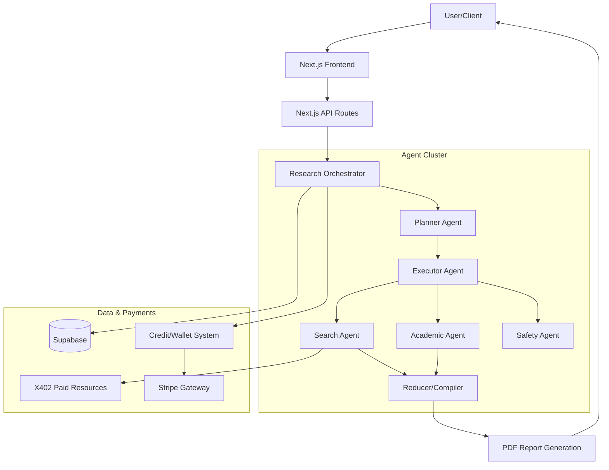
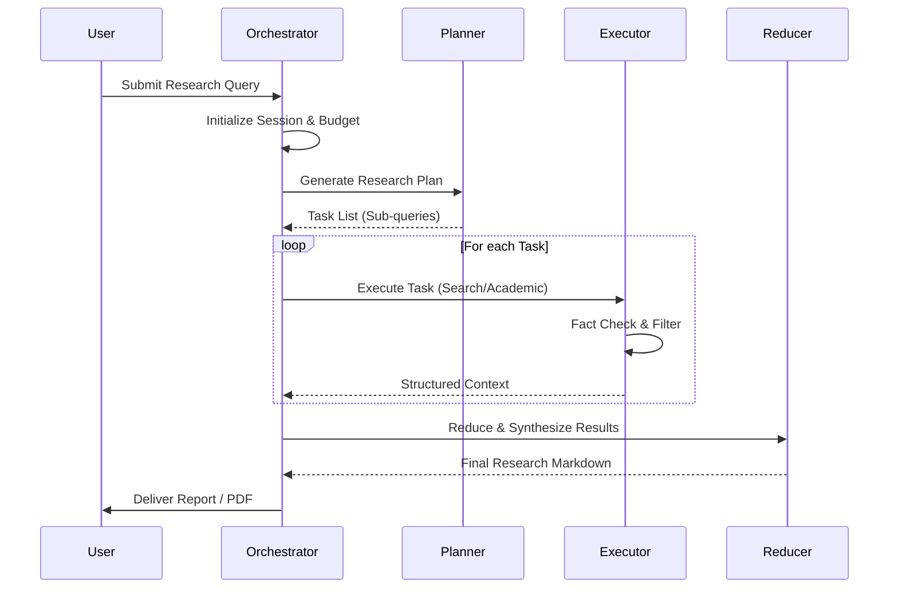
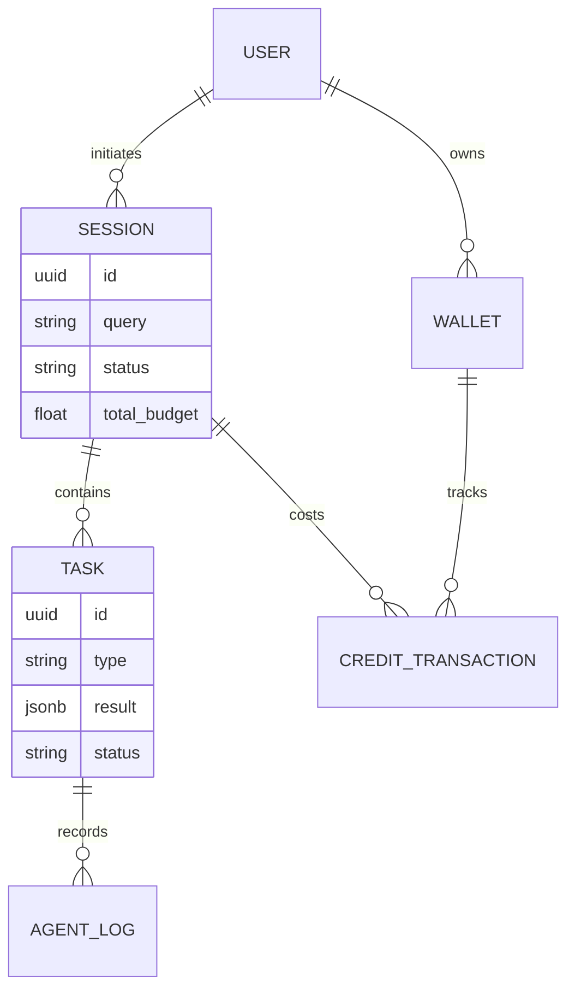

# Axiom

The Autonomous Agentic Research Engine for Deep Fact-Checking and Verified Intelligence.


Axiom is a sophisticated multi-agent orchestration platform designed to perform deep autonomous research. It utilizes a budget-aware execution model to coordinate specialized agents—Academic, Search, and Safety—to produce verified, high-fidelity research reports with integrated payment rails for premium data access.

---

## Visual Diagrams

### System Architecture
The following diagram illustrates the high-level architecture of Axiom, showcasing the interaction between the frontend, the agent orchestrator, and external resource providers.



### Research Sequence Flow
This sequence diagram tracks the lifecycle of a research task from initial query to final synthesis.



### Entity Relationship Diagram
The database schema focuses on managing research sessions, agent tasks, and the internal economy.



---

## Problem Statement

Traditional AI search tools often suffer from two major flaws: hallucination and the "surface-web" limitation. Researchers need access to high-quality, often gated or paid, academic data and a way to verify claims across multiple sources autonomously. Managing the costs of these premium APIs and compute resources requires a robust, budget-conscious orchestration layer that standard LLM wrappers lack.

---

## Solution Overview

Axiom solves this by implementing an Agentic Research Workflow. It breaks down complex queries into manageable sub-tasks handled by specialized agents. By integrating a custom "X402" resource payment protocol and a localized wallet system, Axiom can autonomously purchase access to high-fidelity data while staying within a user-defined budget. Every finding is passed through a Safety and Fact-Checking agent before being compiled into a professional PDF report.

---

## Key Features

*   **Multi-Agent Orchestration**: A Planner-Executor-Reducer architecture that manages complex research lifecycles.
*   **Budget-Aware Execution**: Automated task prioritization based on available credits and resource costs.
*   **Academic & Deep Web Integration**: Specialized adapters for Tavily and academic fetchers to ensure high-quality sourcing.
*   **X402 Payment Protocol**: A specialized framework for handling paid resource requests within an autonomous agent loop.
*   **Real-time Session Monitoring**: Live streaming of agent thoughts, tasks, and findings via a dashboard.
*   **Verified Reporting**: Automated synthesis of findings into formatted markdown and downloadable PDF documents.

---

## Tech Stack

| Category | Technology | Purpose |
| :--- | :--- | :--- |
| Framework | Next.js 15 | Full-stack React framework for UI and API routes. |
| Language | TypeScript | Type-safe development across the agentic pipeline. |
| AI Models | Google Gemini | Primary LLM for planning, execution, and synthesis. |
| Database | Supabase (PostgreSQL) | Persistence for sessions, tasks, and user wallets. |
| Payments | Stripe | Fiat-to-credit conversion for research budgeting. |
| Styling | Tailwind CSS / Shadcn UI | Professional, responsive interface components. |
| Search | Tavily AI | Optimized search engine for AI agents. |

---

## Quick Start/Installation

### Prerequisites
*   Node.js 20+ 
*   Supabase Account
*   Stripe Account

### Setup Commands

1.  **Clone the repository**
    ```bash
    git clone https://github.com/TanmayAggarwal87/axiom.git
    cd axiom
    ```

2.  **Install dependencies**
    ```bash
    npm install
    ```

3.  **Database Migration**
    Apply the Supabase migrations to set up the schema:
    ```bash
    # Ensure you have the Supabase CLI installed
    supabase start
    supabase db reset
    ```

4.  **Run Development Server**
    ```bash
    npm run dev
    ```

---

## Environment Variables

| Variable | Description | Example | Required |
| :--- | :--- | :--- | :--- |
| `NEXT_PUBLIC_SUPABASE_URL` | Supabase project URL | `https://xyz.supabase.co` | Yes |
| `SUPABASE_SERVICE_ROLE_KEY` | Admin key for backend DB operations | `eyJhbG...` | Yes |
| `GEMINI_API_KEY` | Google AI Studio key | `AIza...` | Yes |
| `TAVILY_API_KEY` | Tavily search API key | `tvly-...` | Yes |
| `STRIPE_SECRET_KEY` | Stripe backend secret | `sk_test_...` | Yes |
| `TREASURY_PRIVATE_KEY` | Key for X402 resource signing | `0x...` | Yes |

### Example .env
```text
NEXT_PUBLIC_SUPABASE_URL=your_project_url
NEXT_PUBLIC_SUPABASE_ANON_KEY=your_anon_key
SUPABASE_SERVICE_ROLE_KEY=your_service_key
GEMINI_API_KEY=your_gemini_key
TAVILY_API_KEY=your_tavily_key
STRIPE_SECRET_KEY=your_stripe_key
STRIPE_WEBHOOK_SECRET=your_webhook_secret
TREASURY_PRIVATE_KEY=your_hex_private_key
```

---

## API Endpoints

| Method | Endpoint | Description | Auth |
| :--- | :--- | :--- | :--- |
| POST | `/api/research/start` | Initialize a new research session. | JWT |
| GET | `/api/research/session/[id]` | Fetch status and logs for a session. | JWT |
| POST | `/api/wallet/topup` | Create a Stripe checkout for credits. | JWT |
| POST | `/api/x402-resource` | Handle paid agent resource requests. | API Key |

### Start Research Example
```bash
curl -X POST https://axiom.app/api/research/start \
  -H "Content-Type: application/json" \
  -d '{
    "query": "Impact of Llama 3 on open source LLM benchmarks",
    "budget": 5.00
  }'
```

---

## Project Structure

```text
axiom/
├── src/
│   ├── agents/            # Specialized agent definitions (Safety, Search, Academic)
│   ├── app/               # Next.js App Router (Pages and API Routes)
│   ├── components/        # UI Components (Research views, Wallet, Layout)
│   ├── lib/
│   │   ├── orchestrator/  # Core logic: Planner, Executor, Reducer
│   │   ├── x402/          # Payment protocol for resources
│   │   └── supabase/      # Database client and helpers
│   └── types/             # Shared TypeScript definitions
├── scripts/               # Key generation and E2E testing scripts
├── supabase/              # SQL migrations and configuration
└── public/                # Static assets and icons
```

---

## Deployment & Architecture Decisions

*   **Hosting**: The platform is designed for Vercel/Supabase. Vercel's edge functions are used for UI, while long-running agent tasks are handled via specialized route handlers with extended timeouts.
*   **Modularity**: Agents are decoupled from the orchestrator. This allows for swapping Gemini with GPT-4 or local models (via Ollama) without refactoring the planning logic.
*   **State Management**: Instead of complex Redux/Zustand logic, research state is persisted in Supabase and polled/streamed. This ensures that a page refresh doesn't lose the agent's progress.

---

## Technical Challenges & Solutions

### Challenge 1: Autonomous Resource Payment
**Problem**: Agents needed a way to access paid APIs without manual user intervention for every transaction.
**Solution**: Developed the **X402 Protocol**, which allows agents to request a "Payment Proof" from the internal treasury. If the session budget allows, the treasury signs a transaction that the agent presents to the resource fetcher, creating a seamless machine-to-machine economy.

### Challenge 2: Context Window Management
**Problem**: Deep research generates massive amounts of text that exceed LLM context windows during the synthesis phase.
**Solution**: Implemented a **Reducer Pattern**. Instead of feeding all raw data to the final agent, each sub-task result is summarized individually. The Reducer then organizes these summaries into a coherent structure, significantly reducing token usage while maintaining detail.

---

## Development Commands

| Command | Description |
| :--- | :--- |
| `npm run dev` | Starts the Next.js development server. |
| `npm run build` | Builds the production application. |
| `npm run test` | Runs the test suite for orchestrators and agents. |
| `npm run generate-keys` | Generates new treasury keys for the X402 protocol. |

---

## Testing Approach

*   **Unit Testing**: Focused on agent logic in `src/agents/__tests__`, mocking API calls to Tavily and Gemini.
*   **Orchestration Testing**: Simulating full research cycles in `src/lib/orchestrator/__tests__` to ensure the Planner correctly breaks down queries.
*   **Integration Testing**: E2E scripts in `scripts/e2e-test.ts` verify the connection between the wallet, database, and agent executor.

---

## Contributing Guidelines

We welcome contributions to Axiom. If you are interested in improving the agentic logic, adding new adapters, or enhancing the UI, please fork the repository and submit a PR. Focus on maintaining the modularity of the `src/agents` directory and ensure all new features include corresponding TypeScript types.

---

## License

This project is licensed under the MIT License.

---

Built by Team DhoomCoders

